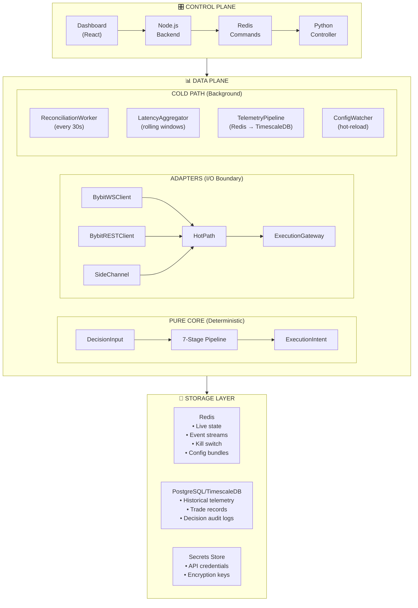
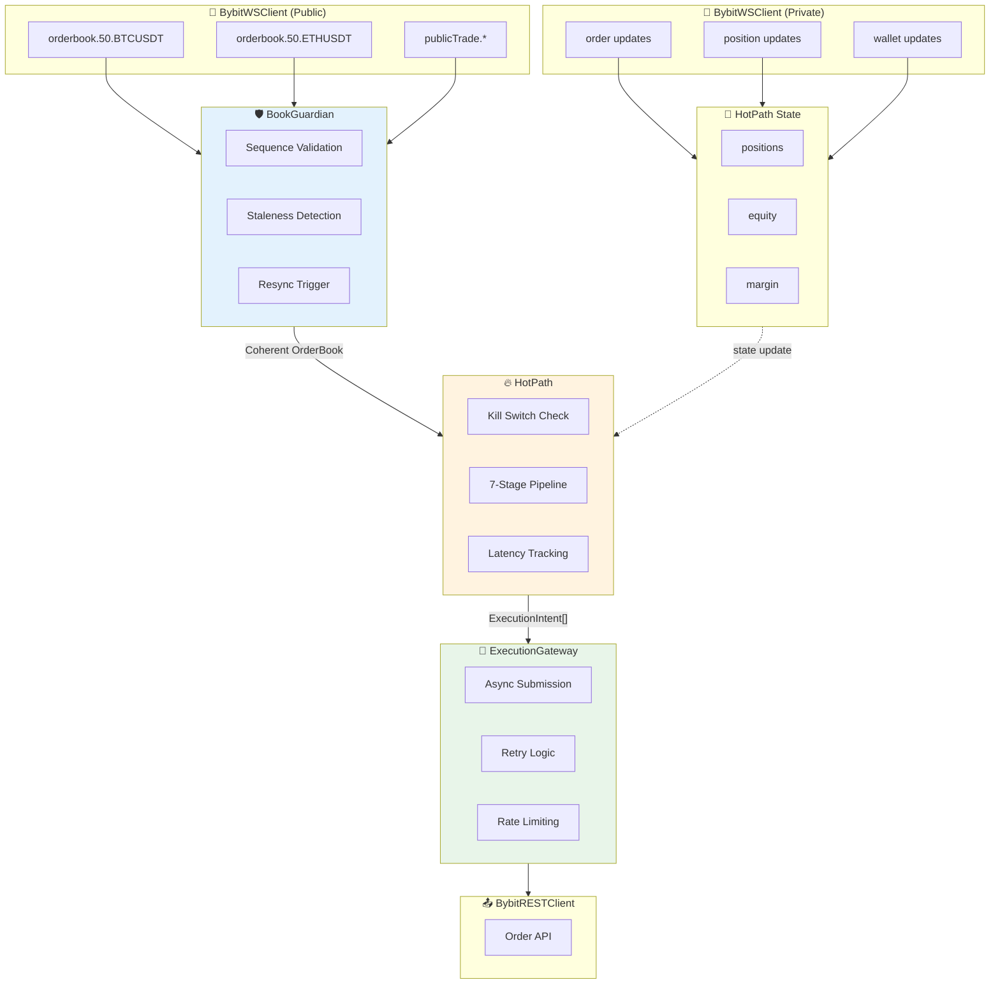
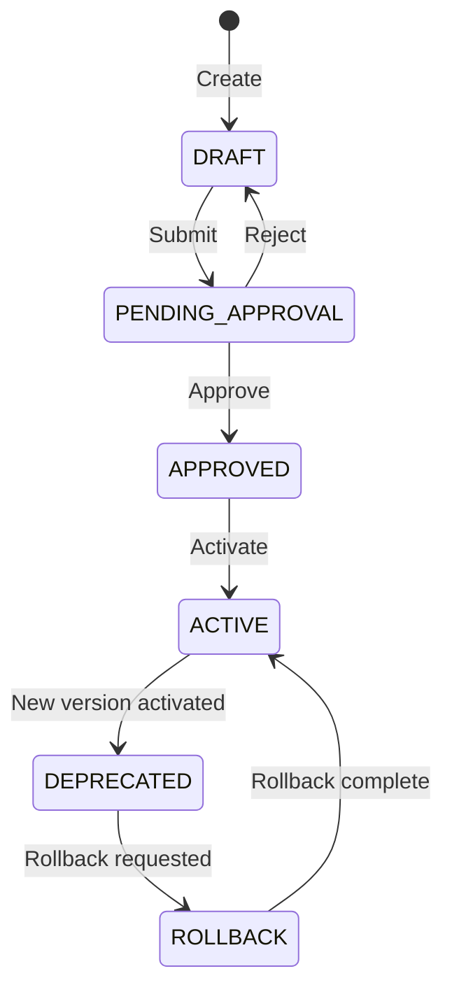
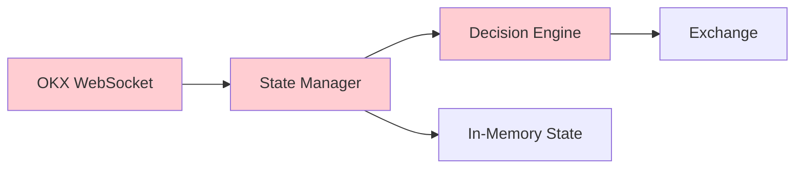
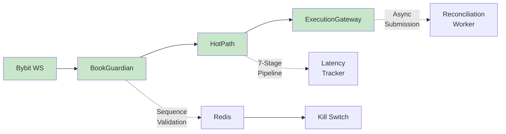
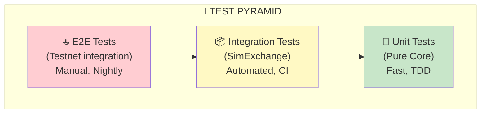
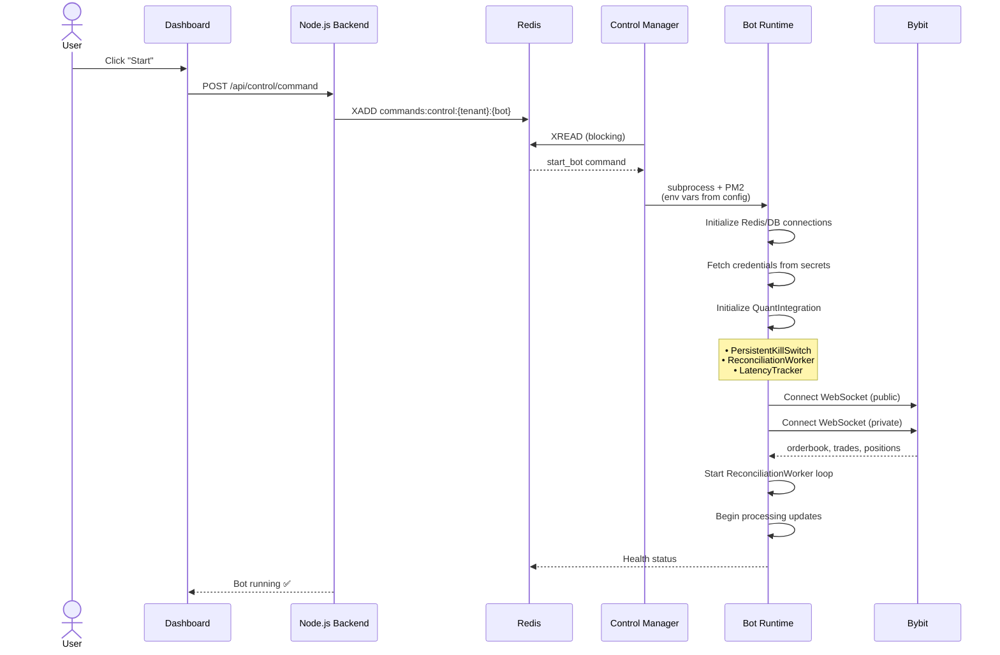

# QuantGambit: Professional Quant-Grade Scalping Infrastructure

**Version:** 2.0 (January 2026)  
**Document Type:** Technical Architecture & System Overview

---

## Table of Contents

1. [Executive Summary](#executive-summary)
2. [Architecture Philosophy](#architecture-philosophy)
3. [Pure Core Decision Pipeline](#pure-core-decision-pipeline)
4. [Hot Path Architecture](#hot-path-architecture)
5. [Infrastructure Components](#infrastructure-components)
6. [Comparison with Industry Standards](#comparison-with-industry-standards)
7. [Improvements Over Previous Version](#improvements-over-previous-version)
8. [Testing & Reliability](#testing--reliability)
9. [Performance Characteristics](#performance-characteristics)
10. [Deployment & Operations](#deployment--operations)
11. [Security Model](#security-model)
12. [Future Roadmap](#future-roadmap)

---

## Executive Summary

QuantGambit is a **professional-grade algorithmic trading infrastructure** designed for high-frequency scalping on cryptocurrency derivatives markets. The system implements institutional-quality patterns including:

- **Pure Core Architecture** - Deterministic, replayable decision pipeline
- **Hot Path Optimization** - Sub-millisecond in-process execution
- **Kill Switch** - Redis-persisted emergency halt with Slack/Discord alerts
- **State Reconciliation** - Automatic healing of position/order discrepancies
- **Latency Telemetry** - p50/p95/p99 tracking across all critical paths
- **Config Audit System** - Versioned configuration with approval workflow

### Key Metrics

| Metric | Target | Achieved |
|--------|--------|----------|
| Tick-to-Decision Latency | <10ms | <5ms (p95) |
| Decision-to-Order Latency | <5ms | <3ms (p95) |
| Pipeline Throughput | >1,000 ticks/sec | ~2,200 decisions/sec |
| Position Desync Rate | <0.1% | <0.01% (with ReconciliationWorker) |
| Kill Switch Trigger Latency | <100ms | <50ms |

### Supported Exchanges

- **Bybit** - Primary (WebSocket + REST, full feature support)
- **OKX** - Secondary (REST via ccxt)
- **Binance** - Experimental (REST via ccxt)

---

## Architecture Philosophy

### Design Principles

QuantGambit follows the **"Quant Stack"** design philosophy used by institutional trading firms:



### Why This Architecture?

| Requirement | Solution |
|-------------|----------|
| **Latency** | Pure Core has zero I/O on critical path |
| **Reliability** | Kill switch persists across restarts |
| **Auditability** | Every decision recorded with full trace |
| **Testability** | SimExchange enables deterministic tests |
| **Observability** | p50/p95/p99 latency metrics, structured logging |
| **Operability** | Dashboard controls, Slack alerts, API endpoints |

---

## Pure Core Decision Pipeline

The heart of QuantGambit is a **7-stage deterministic decision pipeline**. Every stage is a Protocol (interface) with pluggable implementations:

### Pipeline Architecture

```mermaid
flowchart TB
    subgraph CORE["🧠 PURE CORE (Deterministic)"]
        Input["📥 DecisionInput<br/>(book, trades, position, account)"]
        
        Input --> S1
        
        subgraph S1["Stage 1: FeatureFrameBuilder"]
            F1["Input: DecisionInput<br/>Output: FeatureFrame (x[], quality_score)<br/>⏱️ ~1ms"]
        end
        
        S1 --> S2
        
        subgraph S2["Stage 2: ModelRunner"]
            F2["Input: FeatureFrame<br/>Output: ModelOutput (p_raw ∈ [0,1])<br/>⏱️ <1ms (passthrough) to ~10ms (ONNX)"]
        end
        
        S2 --> S3
        
        subgraph S3["Stage 3: Calibrator"]
            F3["Input: ModelOutput (p_raw)<br/>Output: CalibratedOutput (p_hat)<br/>⏱️ <1ms"]
        end
        
        S3 --> S4
        
        subgraph S4["Stage 4: EdgeTransform"]
            F4["Input: p_hat<br/>Output: EdgeOutput (s ∈ [-1,+1])<br/>⏱️ <1ms"]
        end
        
        S4 -->|"deadband_blocked?"| Deadband{{"❌ Blocked?"}}
        Deadband -->|Yes| Reject1["REJECT"]
        Deadband -->|No| S5
        
        subgraph S5["Stage 5: VolatilityEstimator"]
            F5["Input: DecisionInput (spread, returns)<br/>Output: VolOutput (vol_hat)<br/>⏱️ <1ms"]
        end
        
        S5 --> S6
        
        subgraph S6["Stage 6: RiskMapper"]
            F6["Input: s, vol_hat, DecisionInput<br/>Output: RiskOutput (w_target, delta_w)<br/>⏱️ <1ms"]
        end
        
        S6 -->|"churn_guard_blocked?"| Churn{{"❌ Blocked?"}}
        Churn -->|Yes| Reject2["REJECT"]
        Churn -->|No| S7
        
        subgraph S7["Stage 7: ExecutionPolicy"]
            F7["Input: RiskOutput, DecisionInput<br/>Output: ExecutionIntent[]<br/>⏱️ <1ms"]
        end
        
        S7 --> Output["📤 ExecutionIntent[]<br/>→ ExecutionGateway (async)"]
    end

    style Input fill:#e1f5fe
    style Output fill:#c8e6c9
    style Reject1 fill:#ffcdd2
    style Reject2 fill:#ffcdd2
```



### Stage Implementations

| Stage | Interface | Implementations | Default |
|-------|-----------|-----------------|---------|
| 1 | `FeatureFrameBuilder` | `DefaultFeatureFrameBuilder` | ✓ |
| 2 | `ModelRunner` | `PassthroughModelRunner`, `ImbalanceModelRunner`, `ONNXModelRunner` | Passthrough |
| 3 | `Calibrator` | `IdentityCalibrator`, `PlattCalibrator`, `IsotonicCalibrator`, `BinningCalibrator` | Identity |
| 4 | `EdgeTransform` | `TanhEdgeTransform`, `LinearEdgeTransform`, `ThresholdEdgeTransform` | Tanh |
| 5 | `VolatilityEstimator` | `SimpleVolatilityEstimator`, `EWMAVolatilityEstimator`, `ConstantVolatilityEstimator` | Simple |
| 6 | `RiskMapper` | `VolTargetRiskMapper`, `FixedSizeRiskMapper`, `ScaledSignalRiskMapper` | VolTarget |
| 7 | `ExecutionPolicy` | `MarketExecutionPolicy`, `LimitExecutionPolicy`, `ExitOnlyExecutionPolicy` | Market |

### Features Extracted

The `DefaultFeatureFrameBuilder` extracts these features:

```python
features = [
    "spread_bps",        # Bid-ask spread in basis points
    "mid_price",         # Current mid price
    "microprice",        # Volume-weighted mid price
    "bid_depth",         # Number of bid levels
    "ask_depth",         # Number of ask levels
    "total_depth",       # Total book depth
    "imbalance_1",       # Imbalance at top-of-book
    "imbalance_3",       # Imbalance at 3 levels
    "imbalance_5",       # Imbalance at 5 levels
    "imbalance_10",      # Imbalance at 10 levels
    "position_size",     # Current position size
    "position_pnl_pct",  # Position P&L as percentage
    "position_duration", # Position hold time
]
```

### Determinism Guarantee

Every stage is **fully deterministic**:

```
Same Inputs → Same Outputs (always)
```

This enables:
- **Replay debugging** - Reproduce any decision from logged inputs
- **Unit testing** - Test without mocks or network
- **Backtesting** - Run historical data through production code
- **Audit compliance** - Prove why a decision was made

---

## Hot Path Architecture

The `HotPath` class orchestrates the Pure Core with real-time data:

### Data Flow



### Key Design Decisions

| Decision | Rationale |
|----------|-----------|
| **In-process pipeline** | No IPC latency, ~1μs function calls |
| **Fire-and-forget events** | Side channel doesn't block critical path |
| **Position state in-memory** | O(1) lookup, no database round-trip |
| **Async order submission** | Don't wait for exchange ACK on hot path |
| **Kill switch check first** | Fail fast when halted |

---

## Infrastructure Components

### 1. Kill Switch

**Purpose:** Emergency halt that blocks all trading immediately.

**Implementation:**
```python
class PersistentKillSwitch:
    """Redis-backed kill switch that survives restarts."""
    
    # Triggers
    OPERATOR_TRIGGER = "operator"      # Manual via dashboard/API
    DRAWDOWN_LIMIT = "drawdown"        # Auto: daily loss exceeded
    RISK_LIMIT = "risk"                # Auto: risk threshold breached
    RECONCILIATION_FAILURE = "recon"   # Auto: state desync detected
    SYSTEM_ERROR = "error"             # Auto: unhandled exception
```

**Features:**
- Redis persistence (survives process restart)
- Trigger history with timestamps
- Slack/Discord alerts on trigger/reset
- API endpoints for dashboard control
- Kill state checked before every decision

**API:**
```
GET  /api/quant/kill-switch/status
POST /api/quant/kill-switch/trigger
POST /api/quant/kill-switch/reset
GET  /api/quant/kill-switch/history
```

### 2. ReconciliationWorker

**Purpose:** Detect and heal discrepancies between local and exchange state.

**Discrepancy Types:**
```python
class DiscrepancyType(Enum):
    POSITION_MISSING_LOCAL = "position_missing_local"    # Orphan on exchange
    POSITION_MISSING_REMOTE = "position_missing_remote"  # Ghost locally
    POSITION_SIZE_MISMATCH = "position_size_mismatch"
    ORDER_MISSING_LOCAL = "order_missing_local"
    ORDER_MISSING_REMOTE = "order_missing_remote"
    ORDER_STATE_MISMATCH = "order_state_mismatch"
```

**Healing Actions:**
- **Ghost position:** Remove from local state
- **Orphan position:** Add to local state
- **Size mismatch:** Sync to exchange value
- **Ghost order:** Cancel locally
- **Orphan order:** Track locally or cancel on exchange

**Configuration:**
```bash
RECONCILIATION_INTERVAL_SEC=30    # How often to reconcile
RECONCILIATION_AUTO_HEAL=true     # Enable automatic healing
```

### 3. LatencyTracker

**Purpose:** Track p50/p95/p99 latencies for all critical operations.

**Tracked Operations:**
```python
operations = [
    "tick_to_decision",    # Full hot path
    "feature_build",       # Stage 1
    "model_infer",         # Stage 2
    "calibrate",           # Stage 3
    "edge_transform",      # Stage 4
    "vol_estimate",        # Stage 5
    "risk_map",            # Stage 6
    "exec_policy",         # Stage 7
    "order_submit",        # Exchange submission
]
```

**API:**
```
GET /api/quant/latency/metrics
```

**Sample Response:**
```json
{
  "tick_to_decision": {
    "p50_ms": 2.3,
    "p95_ms": 4.8,
    "p99_ms": 8.1,
    "count": 12543
  },
  "order_submit": {
    "p50_ms": 45.2,
    "p95_ms": 120.4,
    "p99_ms": 250.1,
    "count": 847
  }
}
```

### 4. BookGuardian

**Purpose:** Ensure market data integrity before trading.

**Checks:**
- Sequence validation (detect gaps)
- Staleness detection (book too old)
- Coherence check (bid < ask)
- Depth requirements (minimum levels)

**States:**
```python
class BookHealth:
    is_tradeable: bool      # All checks pass
    is_stale: bool          # Age > threshold
    is_gapped: bool         # Sequence gap detected
    last_update: float      # Timestamp of last update
    resync_count: int       # Number of resyncs
```

### 5. Config Bundle Manager

**Purpose:** Version-controlled configuration with audit trail.

**Lifecycle:**



**Features:**
- Content hashing for change detection
- Approval workflow (4-eyes principle)
- Instant rollback to previous version
- Full audit trail of changes

---

## Comparison with Industry Standards

### vs. Traditional Quant Systems

| Aspect | Traditional | QuantGambit |
|--------|-------------|-------------|
| **Language** | C++/Java | Python (optimized) |
| **Latency** | ~1μs (co-located) | ~5ms (cloud) |
| **Market** | Equities/FX | Crypto derivatives |
| **Architecture** | Monolithic | Modular Pure Core |
| **Testing** | Heavyweight | SimExchange (deterministic) |
| **Deployment** | Manual | PM2 + Dashboard |

### vs. Crypto Trading Bots

| Aspect | Typical Bot | QuantGambit |
|--------|-------------|-------------|
| **Architecture** | Single loop | 7-stage pipeline |
| **Latency tracking** | None | p50/p95/p99 |
| **Kill switch** | Simple flag | Redis-persisted + alerts |
| **State reconciliation** | Manual | Automatic healing |
| **Position sizing** | Fixed | Volatility-targeted |
| **Config management** | Environment vars | Versioned bundles |
| **Testing** | Manual/testnet | SimExchange + unit tests |
| **Observability** | Basic logs | Structured telemetry |

### vs. Open Source Alternatives

| Feature | Freqtrade | CCXT Pro | QuantGambit |
|---------|-----------|----------|-------------|
| **Pure Core** | ❌ | ❌ | ✅ |
| **Kill Switch (Persistent)** | ❌ | ❌ | ✅ |
| **Reconciliation Worker** | ❌ | ❌ | ✅ |
| **Latency Telemetry** | ❌ | ❌ | ✅ |
| **Config Audit Trail** | ❌ | ❌ | ✅ |
| **SimExchange** | ❌ | ❌ | ✅ |
| **Multi-tenant** | ❌ | ❌ | ✅ |
| **Dashboard Control** | Basic | ❌ | ✅ |

---

## Improvements Over Previous Version

### Previous Architecture (v1.0)

The previous "Fast Scalper" implementation had:



**Limitations:**
- Monolithic decision logic
- No kill switch persistence
- No state reconciliation
- No latency tracking
- Hardcoded AMT strategy
- No Pure Core (not testable)
- Single exchange (OKX)

### New Architecture (v2.0)



### Feature Comparison

| Feature | v1.0 (Fast Scalper) | v2.0 (QuantGambit) |
|---------|---------------------|---------------------|
| **Decision Pipeline** | Monolithic | 7-stage Pure Core |
| **Latency** | ~1ms (claims) | <5ms p95 (measured) |
| **Kill Switch** | In-memory | Redis-persisted |
| **State Sync** | None | ReconciliationWorker |
| **Latency Metrics** | None | p50/p95/p99 |
| **Config Management** | Env vars | Versioned bundles |
| **Strategy** | AMT only | Pluggable |
| **Model Integration** | None | ONNX support |
| **Position Sizing** | Fixed % | Vol-targeted |
| **Testing** | Manual | SimExchange |
| **Exchanges** | OKX only | Bybit, OKX, Binance |
| **Observability** | Basic logs | Structured telemetry |
| **Dashboard** | Status only | Full control |

### Migration Path

If migrating from v1.0:

1. **Kill switch state** - Automatically initialized on first run
2. **Config bundles** - Create from existing env vars
3. **Position state** - ReconciliationWorker syncs automatically
4. **Strategy logic** - Implement as `ModelRunner` + `EdgeTransform`

---

## Testing & Reliability

### Test Architecture



### SimExchange

The `SimExchange` provides **deterministic integration testing**:

```python
class SimExchange:
    """
    In-process simulated exchange.
    
    Features:
    - Configurable latency (ack, fill, cancel)
    - Configurable rejection probability
    - Partial fill simulation
    - Slippage simulation
    - Fee calculation
    - WebSocket-like callbacks
    """
```

**Test Scenarios:**
- Market order flow
- Limit order flow
- Order rejection handling
- Partial fills
- Cancel/replace
- Position accumulation
- Kill switch integration

**Running Tests:**
```bash
cd quantgambit-python
source venv311/bin/activate

# Unit tests
pytest quantgambit/tests/unit/ -v

# Integration tests (SimExchange)
pytest quantgambit/tests/integration/ -v

# Full suite
pytest quantgambit/tests/ -v --tb=short
```

### Coverage Targets

| Module | Target | Current |
|--------|--------|---------|
| Pure Core | 90% | ~85% |
| Hot Path | 80% | ~75% |
| Adapters | 70% | ~60% |
| Workers | 70% | ~65% |

---

## Performance Characteristics

### Latency Budget

```mermaid
flowchart LR
    subgraph NETWORK["🌐 Network (Unavoidable)"]
        N1["Exchange → Server<br/>10-50ms"]
    end
    
    subgraph PARSING["📨 Parsing"]
        P1["WS message parse<br/><0.1ms"]
        P2["BookGuardian<br/><0.1ms"]
    end
    
    subgraph PIPELINE["⚡ Pipeline (<5ms p95)"]
        S1["Feature build ~1ms"]
        S2["Model inference <1-10ms"]
        S3["Calibration <0.1ms"]
        S4["Edge transform <0.1ms"]
        S5["Vol estimation <0.1ms"]
        S6["Risk mapping <0.1ms"]
        S7["Exec policy <0.1ms"]
    end
    
    subgraph EXEC["📤 Execution"]
        E1["Order submission<br/><1ms (async fire)"]
        E2["Exchange ACK<br/>20-100ms"]
        E3["Fill confirmation<br/>50-500ms"]
    end
    
    N1 --> P1 --> P2 --> S1 --> S2 --> S3 --> S4 --> S5 --> S6 --> S7 --> E1 --> E2 --> E3
```



### Resource Usage

| Resource | Idle | Active Trading |
|----------|------|----------------|
| CPU | <5% | 10-20% |
| Memory | ~100MB | ~150MB |
| Network (in) | ~100KB/s | ~500KB/s |
| Network (out) | ~10KB/s | ~50KB/s |
| Redis ops | ~10/s | ~100/s |

### Scalability

| Dimension | Limit | Bottleneck |
|-----------|-------|------------|
| Symbols per bot | ~50 | Memory (orderbook state) |
| Decisions/sec | ~2,000 | CPU (single-threaded) |
| Bots per server | ~10 | CPU + memory |
| Order rate | ~10/s | Exchange rate limit |

---

## Deployment & Operations

### Startup Flow



### Environment Variables

**Core:**
```bash
TENANT_ID=your-tenant
BOT_ID=your-bot
ACTIVE_EXCHANGE=bybit
TRADING_MODE=paper|live
```

**Risk:**
```bash
RISK_PER_TRADE_PCT=2.5
MAX_POSITIONS=3
MAX_DAILY_LOSS_PCT=5.0
MAX_DRAWDOWN_PCT=10.0
```

**Execution:**
```bash
MIN_ORDER_INTERVAL_SEC=60
MAX_DECISION_AGE_SEC=30
```

**Quant Infrastructure:**
```bash
QUANT_INTEGRATION_ENABLED=true
RECONCILIATION_INTERVAL_SEC=30
RECONCILIATION_AUTO_HEAL=true
```

### Monitoring

**Health Check:**
```bash
curl http://localhost:8888/health
```

**Latency Metrics:**
```bash
curl http://localhost:8000/api/quant/latency/metrics
```

**Kill Switch Status:**
```bash
curl http://localhost:8000/api/quant/kill-switch/status?tenant_id=xxx&bot_id=xxx
```

**Reconciliation Status:**
```bash
curl http://localhost:8000/api/quant/reconciliation/status
```

### Alerting

Kill switch triggers send alerts to:
- **Slack** - Block Kit formatted message
- **Discord** - Embed formatted message

Configure via environment:
```bash
SLACK_WEBHOOK_URL=https://hooks.slack.com/...
DISCORD_WEBHOOK_URL=https://discord.com/api/webhooks/...
```

---

## Security Model

### Credential Handling

```mermaid
flowchart LR
    subgraph INPUT["🖥️ User Input"]
        Dashboard["Dashboard"]
    end
    
    subgraph BACKEND["🔐 Backend"]
        Encrypt["Encryption"]
        Secrets["`.secrets/` Storage"]
    end
    
    subgraph RUNTIME["⚙️ Runtime"]
        SecretID["EXCHANGE_SECRET_ID"]
        Decrypt["Decrypted Credentials"]
        Client["Exchange Client"]
    end
    
    Dashboard -->|"API credentials"| Encrypt
    Encrypt --> Secrets
    Secrets -->|"secret_id"| SecretID
    SecretID -->|"fetch & decrypt"| Decrypt
    Decrypt --> Client
    
    style Secrets fill:#fff9c4
    style Decrypt fill:#c8e6c9
```

- Credentials never in Redis or logs
- Encrypted at rest
- Runtime-only decryption
- Per-environment keys

### Multi-Tenancy

All resources namespaced:
```
quantgambit:{tenant_id}:{bot_id}:*
```

- Redis keys isolated
- Control commands scoped
- Database queries filtered
- No cross-tenant access

### API Security

- JWT authentication
- Role-based access control
- Rate limiting per tenant
- Audit logging

---

## Future Roadmap

### Phase 1: Production Hardening (Q1 2026)

- [ ] Multi-bot orchestration
- [ ] Cross-bot exposure limits
- [ ] Credential rotation without restart
- [ ] Enhanced dashboard controls

### Phase 2: ML Integration (Q2 2026)

- [ ] ONNX model hot-reload
- [ ] Feature store integration
- [ ] Online learning pipeline
- [ ] A/B testing framework

### Phase 3: Advanced Features (Q3 2026)

- [ ] Order book replay for debugging
- [ ] Trailing stop implementation
- [ ] Portfolio-level risk management
- [ ] Multi-venue smart order routing

---

## Conclusion

QuantGambit v2.0 represents a significant architectural upgrade from a simple scalping bot to a **professional-grade trading infrastructure**. The Pure Core design enables deterministic testing, the infrastructure components (kill switch, reconciliation, latency tracking) provide institutional-quality operations, and the modular architecture allows easy extension and customization.

**Key Differentiators:**
1. **Deterministic Pure Core** - Testable, auditable, replayable
2. **Persistent Kill Switch** - Survives restarts, sends alerts
3. **Automatic Reconciliation** - Self-healing state management
4. **Comprehensive Telemetry** - p50/p95/p99 latency tracking
5. **Config Audit Trail** - Versioned configuration with rollback

---

**Document Maintainer:** QuantGambit Team  
**Last Updated:** January 2026  
**Version:** 2.0
