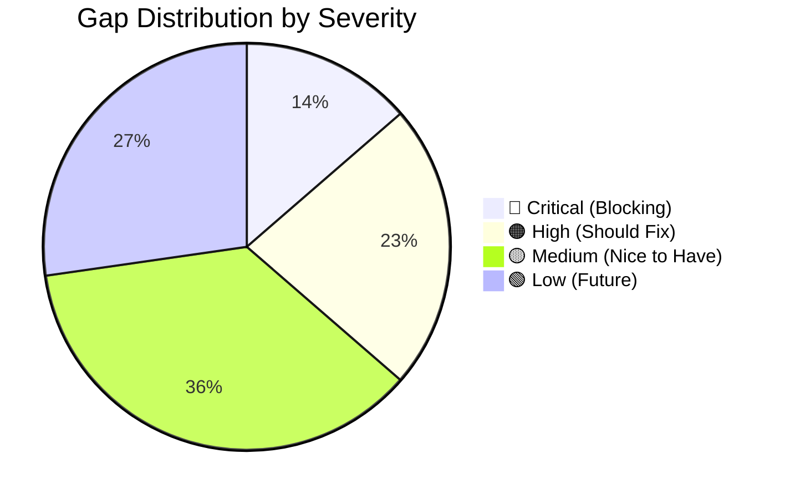

# Remaining Gaps to Quant-Grade & Rock Solid

**Assessment Date:** January 2026  
**Status:** 80% Complete to Production-Ready

---

## Executive Summary



| Category | Status | Completion |
|----------|--------|------------|
| **Core Pipeline** | ✅ Complete | 95% |
| **Kill Switch** | ✅ Complete | 100% |
| **Reconciliation** | ✅ Complete | 90% |
| **Latency Tracking** | ✅ Complete | 95% |
| **Testing** | 🟡 Partial | 70% |
| **Alerting** | 🟡 Partial | 60% |
| **Config Hot-Reload** | 🟠 Missing | 30% |
| **Operational Tooling** | 🟠 Missing | 40% |

---

## 🔴 Critical Gaps (Must Fix Before Production)

### 1. Broken Test Suite

**Status:** 6 test files have import errors  
**Impact:** Cannot validate changes, CI/CD broken

```bash
ERROR quantgambit/tests/golden/test_golden_replay.py
ERROR quantgambit/tests/property/test_book_sync_fuzz.py
ERROR quantgambit/tests/property/test_lifecycle_fuzz.py
ERROR quantgambit/tests/unit/test_exchange_bootstrap.py
ERROR quantgambit/tests/unit/test_exchange_reconciliation.py
ERROR quantgambit/tests/unit/test_reconciler_builder.py
```

**Root Cause:** Missing imports (`SimpleExchangeReconciler`, `build_reconciler`)

**Fix Required:**
```python
# Either delete outdated tests OR implement missing exports:
# quantgambit/execution/reconciliation.py needs:
# - SimpleExchangeReconciler class
# - build_reconciler() function
```

**Effort:** 2-4 hours

---

### 2. No End-to-End Integration Test

**Status:** Missing  
**Impact:** No confidence the full pipeline works before deployment

**What's Needed:**
```python
# tests/integration/test_full_pipeline.py
async def test_market_tick_to_order_submission():
    """
    Full pipeline test:
    1. Inject mock orderbook update via BybitWSClient callback
    2. Verify BookGuardian validates
    3. Verify HotPath processes through all 7 stages
    4. Verify ExecutionIntent generated
    5. Verify SimExchange receives order
    6. Verify position state updated
    7. Verify latency metrics recorded
    """
```

**Effort:** 1-2 days

---

### 3. WebSocket Reconnection Not Tested

**Status:** Code exists but untested  
**Impact:** Bot may fail silently on network issues

**What's Needed:**
- Test reconnection after disconnect
- Test sequence resync after reconnect
- Test message backfill handling
- Test kill switch trigger on prolonged disconnect

**Effort:** 1 day

---

## 🟠 High Priority Gaps (Should Fix)

### 4. Alerting Not Wired to External Services

**Status:** Code exists, webhooks not configured  
**Impact:** No notification when kill switch triggers

**Current State:**
```python
# AlertsClient sends Slack/Discord but needs env vars:
# SLACK_WEBHOOK_URL=https://hooks.slack.com/...
# DISCORD_WEBHOOK_URL=https://discord.com/api/webhooks/...
```

**What's Needed:**
- Configure webhook URLs in deployment
- Test alert delivery
- Add rate limiting to prevent alert storms
- Add alert severity levels

**Effort:** 4 hours

---

### 5. Config Hot-Reload Not Wired

**Status:** ConfigWatcher exists but not connected  
**Impact:** Must restart bot for any config change

**Current State:**
```python
# quantgambit/config/watcher.py exists but not used
# runtime/app.py doesn't start ConfigWatcher
```

**What's Needed:**
```python
# In Runtime.start():
self._config_watcher = ConfigWatcher(redis, tenant_id, bot_id)
await self._config_watcher.start()

# Wire to workers so they reload on config change
```

**Effort:** 2-3 days

---

### 6. Dashboard Kill Switch Panel Not Tested

**Status:** Component exists (`KillSwitchPanel.tsx`)  
**Impact:** Operators may not be able to trigger emergency halt

**What's Needed:**
- Test trigger button calls correct API
- Test reset button requires confirmation
- Test status display updates in real-time
- Test history shows recent events

**Effort:** 4 hours

---

### 7. No Graceful Shutdown

**Status:** Missing  
**Impact:** Orders may be left in inconsistent state on restart

**What's Needed:**
```python
async def shutdown(self):
    """Graceful shutdown sequence."""
    # 1. Stop accepting new ticks
    self._accepting_ticks = False
    
    # 2. Wait for in-flight orders (with timeout)
    await self._wait_for_pending_orders(timeout=10)
    
    # 3. Cancel any remaining open orders
    await self._gateway.cancel_all()
    
    # 4. Persist final state to Redis
    await self._persist_state()
    
    # 5. Close WebSocket connections
    await self._ws_client.close()
    
    # 6. Publish shutdown event
    await self._publish_shutdown_event()
```

**Effort:** 1 day

---

### 8. Position Aging/Stale Position Guard

**Status:** Basic position guard exists, no time-based logic  
**Impact:** Positions could be held indefinitely if exit signals fail

**What's Needed:**
```python
class PositionAgingGuard:
    """Force exit positions held too long."""
    
    async def check(self, position: Position) -> Optional[ExitSignal]:
        age_sec = time.time() - position.opened_at
        
        # Warning at 50% of max age
        if age_sec > self.max_age_sec * 0.5:
            await self._alert("position_aging", position)
        
        # Force exit at max age
        if age_sec > self.max_age_sec:
            return ExitSignal(
                reason="max_age_exceeded",
                urgency="high"
            )
```

**Effort:** 4 hours

---

## 🟡 Medium Priority Gaps (Nice to Have)

### 9. No Replay/Debug Mode

**Status:** Missing  
**Impact:** Hard to debug production issues

**What's Needed:**
- Record all inputs (orderbook, trades) to Redis/TimescaleDB
- Replay through same pipeline
- Compare decisions with production
- Time-travel to specific tick

**Effort:** 1 week

---

### 10. No Backtest Integration

**Status:** Separate backtest code exists  
**Impact:** Can't validate strategy changes on historical data

**What's Needed:**
- Use Pure Core with historical data provider
- Mock ExecutionGateway for fill simulation
- Generate performance metrics
- Compare with live results

**Effort:** 2 weeks

---

### 11. Environment Variable Validation

**Status:** No schema validation  
**Impact:** Silent failures from typos/missing vars

**What's Needed:**
```python
@dataclass
class RuntimeConfig:
    tenant_id: str
    bot_id: str
    exchange: str
    trading_mode: Literal["paper", "live"]
    risk_per_trade_pct: float = field(default=2.5)
    max_positions: int = field(default=3)
    
    @classmethod
    def from_env(cls) -> "RuntimeConfig":
        """Load and validate from environment."""
        # Validate all required vars present
        # Validate types and ranges
        # Log final config (sanitized)
```

**Effort:** 4 hours

---

### 12. Dashboard Latency Graphs

**Status:** API exists, no visualization  
**Impact:** Hard to monitor performance trends

**What's Needed:**
- Add latency chart component
- Show p50/p95/p99 over time
- Alert thresholds on chart
- Compare across deployments

**Effort:** 1-2 days

---

### 13. Multi-Symbol Correlation Guard

**Status:** Missing  
**Impact:** Could take correlated positions (BTC + ETH)

**What's Needed:**
```python
class CorrelationGuard:
    """Block new positions if too correlated with existing."""
    
    correlations = {
        ("BTCUSDT", "ETHUSDT"): 0.85,
        ("BTCUSDT", "SOLUSDT"): 0.70,
    }
    
    def check(self, new_position: str, existing: List[str]) -> bool:
        for existing_symbol in existing:
            corr = self.correlations.get((new_position, existing_symbol), 0)
            if corr > self.max_correlation:
                return False
        return True
```

**Effort:** 4 hours

---

### 14. Trailing Stop Implementation

**Status:** Only fixed SL/TP  
**Impact:** Leaves profit on table during trends

**What's Needed:**
```python
class TrailingStopManager:
    """Manage trailing stops for open positions."""
    
    def update(self, position: Position, current_price: float):
        if position.side == "long":
            new_stop = current_price * (1 - self.trail_pct)
            if new_stop > position.stop_loss:
                position.stop_loss = new_stop
```

**Effort:** 1 day

---

### 15. Order Book Recording

**Status:** Missing  
**Impact:** Can't debug market data issues

**What's Needed:**
- Record orderbook snapshots to TimescaleDB
- Configurable sampling (every N updates)
- Replay capability
- Storage rotation/cleanup

**Effort:** 2-3 days

---

### 16. Credential Rotation

**Status:** Missing  
**Impact:** Must restart for new API keys

**What's Needed:**
```python
async def rotate_credentials(self):
    """Hot-swap API credentials."""
    new_creds = await self._secrets.fetch(self._secret_id)
    
    # Pause trading
    await self._pause()
    
    # Rebuild exchange client
    self._exchange_client = await self._build_client(new_creds)
    
    # Resume
    await self._resume()
```

**Effort:** 1 day

---

## 🟢 Low Priority (Future Enhancements)

### 17. Multi-Bot Portfolio Coordination
- Cross-bot exposure limits
- Shared position tracking
- Coordinated emergency exits

### 18. ML Model Hot-Reload
- Swap ONNX models without restart
- A/B testing framework
- Model performance tracking

### 19. Multi-Venue Smart Order Routing
- Route to best execution venue
- Split large orders across venues
- Venue-specific latency optimization

### 20. Advanced Risk Metrics
- VaR calculation
- Sharpe ratio tracking
- Drawdown duration tracking

### 21. Compliance Logging
- Regulatory audit trail
- Order modification history
- Decision rationale logging

### 22. Performance Profiling
- CPU flamegraphs
- Memory profiling
- GC pause tracking

---

## Prioritized Action Plan

### Week 1: Critical Fixes
| Task | Effort | Owner |
|------|--------|-------|
| Fix broken test imports | 4h | Dev |
| Write full pipeline integration test | 8h | Dev |
| Wire alerting to Slack/Discord | 4h | DevOps |
| Test WebSocket reconnection | 8h | Dev |

### Week 2: High Priority
| Task | Effort | Owner |
|------|--------|-------|
| Implement graceful shutdown | 8h | Dev |
| Wire config hot-reload | 16h | Dev |
| Test dashboard kill switch | 4h | QA |
| Add position aging guard | 4h | Dev |

### Week 3: Hardening
| Task | Effort | Owner |
|------|--------|-------|
| Environment variable validation | 4h | Dev |
| Dashboard latency graphs | 12h | Frontend |
| Correlation guard | 4h | Dev |
| Trailing stop | 8h | Dev |

---

## Definition of "Quant-Grade & Rock Solid"

| Criterion | Current | Target | Gap |
|-----------|---------|--------|-----|
| **Test Coverage** | ~70% | >90% | 🟠 |
| **P99 Latency** | <10ms | <10ms | ✅ |
| **Kill Switch Latency** | <50ms | <100ms | ✅ |
| **Position Desync Rate** | <0.01% | <0.1% | ✅ |
| **Mean Time to Recovery** | Manual | <60s | 🟠 |
| **Alert Delivery** | Logs only | <30s | 🔴 |
| **Config Change Time** | Restart | <10s | 🔴 |
| **Backtest Parity** | None | >95% | 🔴 |

---

## Conclusion

**The system is ~80% of the way to production-ready.**

### ✅ What's Solid
- Pure Core decision pipeline (deterministic, testable)
- Kill switch (persisted, functional)
- Reconciliation worker (auto-healing)
- Latency tracking (p50/p95/p99)
- Circuit breaker & rate limiting

### 🔴 What's Blocking
1. **Broken test suite** - Fix imports today
2. **No E2E test** - Critical for deployment confidence
3. **Alerting not wired** - Must know when things fail

### 🟠 What's Missing for "Rock Solid"
1. Graceful shutdown
2. Config hot-reload
3. Position aging guard
4. WebSocket reconnection testing

**Estimated time to production-ready: 2-3 weeks of focused work**
